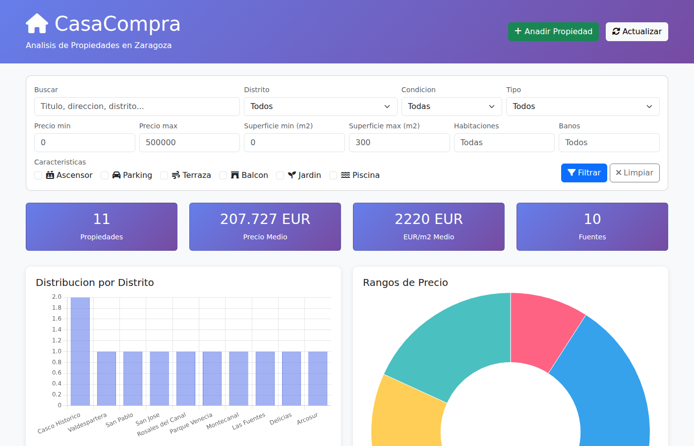
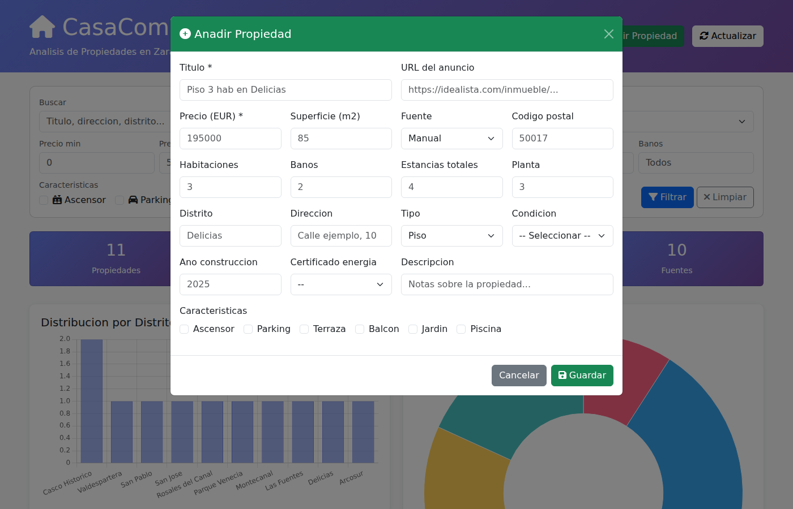
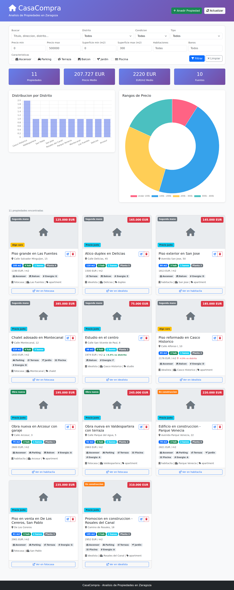
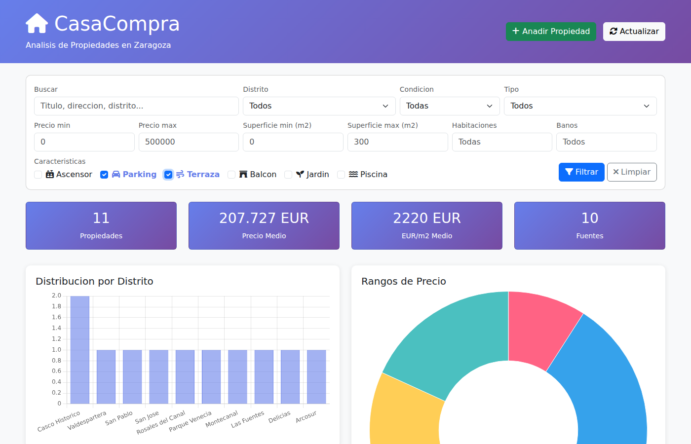

# CasaCompra - Analisis de Propiedades en Zaragoza

Aplicacion web para gestionar, comparar y detectar oportunidades de compra de vivienda en Zaragoza.

Permite registrar propiedades manualmente desde distintos portales (Idealista, Fotocasa, Habitaclia...) y analizar automaticamente cuales representan una buena oportunidad segun el precio por metro cuadrado de cada distrito.



## Funcionalidades

- **Dashboard interactivo** con estadisticas, graficos por distrito y rangos de precio
- **Formulario de alta** para registrar propiedades desde el movil o el ordenador
- **Detector de oportunidades** que compara el precio/m2 de cada propiedad contra la media de su distrito
- **Filtros avanzados**: precio, superficie, habitaciones, banos, distrito, tipo, condicion (obra nueva / en construccion / segunda mano), y caracteristicas (ascensor, parking, terraza, piscina...)
- **Edicion y eliminacion** de propiedades desde la interfaz
- **Vista responsive** adaptada a movil

### Formulario de alta manual



### Vista completa con cards de oportunidad



### Filtrado por caracteristicas



## Stack

- **Backend**: Python + Flask
- **Frontend**: Bootstrap 5 + Chart.js
- **Base de datos**: SQLite
- **Despliegue**: Docker / Docker Compose

## Inicio rapido

```bash
# Clonar el repositorio
git clone https://github.com/agraciag/compra-casa.git
cd compra-casa

# Instalar dependencias
pip install flask beautifulsoup4

# Cargar datos de ejemplo (opcional)
python demo_system.py

# Iniciar la aplicacion
python app.py
# Abrir http://localhost:5001
```

### Con Docker

```bash
docker compose up --build
# Abrir http://localhost:5000
```

## Estructura del proyecto

```
compra-casa/
├── app.py                  # Aplicacion Flask (API REST + vistas)
├── demo_system.py          # Script para cargar datos de ejemplo
├── config/
│   └── settings.py         # Configuracion general
├── src/
│   ├── data_collection.py  # Script de recoleccion de datos
│   ├── scraper/
│   │   └── basic_scraper.py
│   └── utils/
│       ├── database.py     # Capa de acceso a SQLite
│       ├── models.py       # Modelo de datos (dataclass)
│       └── deduplication.py
├── templates/
│   └── index.html          # Dashboard (SPA)
├── screenshots/            # Capturas para el README
├── Dockerfile
├── docker-compose.yml
└── .dockerignore
```

## API

| Metodo | Endpoint | Descripcion |
|---|---|---|
| GET | `/api/properties` | Listar propiedades con filtros |
| POST | `/api/properties` | Crear propiedad |
| GET | `/api/property/<id>` | Detalle de propiedad |
| PUT | `/api/property/<id>` | Actualizar propiedad |
| DELETE | `/api/property/<id>` | Eliminar propiedad |
| GET | `/api/stats` | Estadisticas y medias por distrito |
| GET | `/api/search?q=` | Busqueda por texto |

## Detector de oportunidades

Cada propiedad recibe una puntuacion automatica comparando su precio/m2 contra la media del distrito:

| Etiqueta | Significado |
|---|---|
| **OPORTUNIDAD** | >20% por debajo de la media del distrito |
| **Buen precio** | 10-20% por debajo |
| **Precio justo** | Dentro de la media (0-10%) |
| **Algo caro** | 0-10% por encima |
| **Caro** | >10% por encima |

Cuantas mas propiedades registres por distrito, mas precisas seran las comparaciones.

## Licencia

MIT
